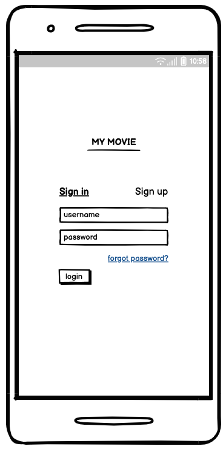
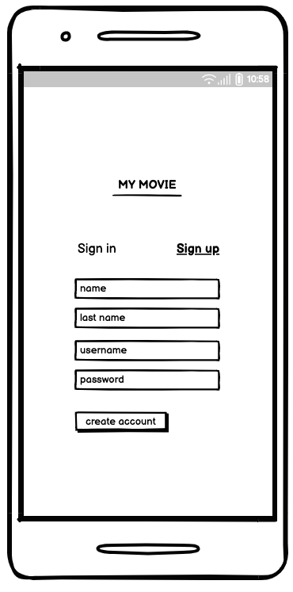
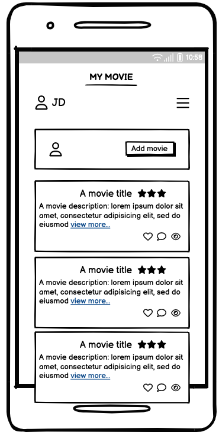
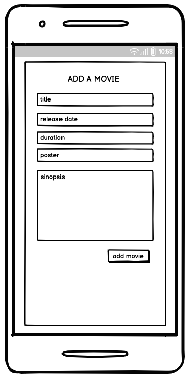
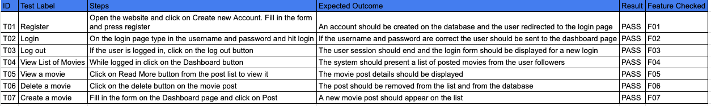

# My Movie Social Network
## Project Portfolio 4

[Link to Heroku app](https://my-movie-pp4.herokuapp.com/)

[Link to GitHub repository](https://github.com/ujuniordev/my-movie-pp4)

The social network for movie lovers

## About the website

My Movie social network was designed for those movie addicts who really love watching movies and want to connect to others who feel the same and share their opinions about the movies they like or not.

## User experience

With a clean, simple and intuitive interface to easily guide the user, the site allows the user to sign up, log in and manage their account's password, create new posts and delete them, follow and unfollow friends and read their posts.

The user stories that were used to develop the site are listed below:

 - **US 01 Register**
As a **user** I can **register** so that **I can have an account and use the platform**.
 - **US 02 Login**
As a **user** I can **login** so that **I can enter the platform and view content**.
 - **US 03 Logout**
As a **user** I can **logout** so that **I can close my session on the platform**.
 - **US 04 View movies - timeline view**
As a **user** I can **view a list of movies** so that **I can navigate the movies in the platform**.
 - **US 05 View a movie**
As a **user** I can **view a movie** so that **I can view detailed information about the movie**.
 - **US 06 Delete a movie**
As an **admin user** I can **delete a movie** so that **having up-to-date movies listed**.
 - **US 07 Create a movie**
As an **admin user** I can **create a movie** so that **new movies are included in the platform for reviews**.
 - **US 08 Comment**
As a **user** I can **add a comment to a movie** so that **I can express my ideas about that movie**.
 - **US 09 Update rating**
As a **user** I can **update my movie rating** so that **I can have up-to-date information about a movie score**.
 - **US 10 Mark a movie as watched**
As a **user** I can **mark a movie as watched** so that **I can add that movie to my total hours of watched movies**.
 - **US 11 Update a comment**
As a **user** I can **update my comment** so that **I can change my comment**.
 - **US 12 Delete a comment**
As a **user** I can **delete a comment** so that **I can erase that information from the platform**.
 - **US 13 Delete rating**
As a **user** I can **delete a rating** so that **I can have up-to-date information about movies**.
 - **US 14 Reply a comment**
As a **user** I can **reply a comment** so that **I can start a discussion about a movie**.
 - **US 15 Search a movie**
As a **user** I can **use a search function** so that **I can search movies in the platform by name**.
 - **US 16 Add a movie to the wishlist**
As a **user** I can **add a movie to my wishlist** so that **I can have a list of movies I would like to watch**.
 - **US 17 Rate a movie**
As a **user** I can **rate a movie** so that **a movie can have a score**.
 - **US 18 Like a movie**
As a **user** I can **like a movie** so that **showing appreciation for that movie**.
 - **US 19 Update account data**
As a **user** I can **update my data** so that **keeping up to date information in my account**.
 - **US 20 Delete account**
As a **user** I can **delete my account** so that **removing my data from the platform**.
 - **US 21 Update movie data**
As an **admin user** I can **update a movie** so that **movies are up to date**.

## Features

This website contains the following features that were developed considering the user's stories listed in the section User experience above. Not all features were developed. The agile MoSCoW method was used to define which of the features would be implemented and all the must haves except one (Rate a movie) were implemented.
 - **F1 Register (using US01)**
When a non registered user navigates do the website, he is given the option to register for a new account.
 - **F2 Login (using US02)**
Once the new user is registered on the website, he is able to log in with his username and password.
 - **F3 Log out (using US03)**
There is a log out button which is presented to an authenticated user that once clicked ends the current session and send the user to the main page.
 - **F4 View list of movies (using US04)**
On the Dashboard page the user can see a list of movies posted by the users he follows.
 - **F5 View a movie (using US05)**
If the user clicks on the "Read More" button which is displayed with the movie title on the movie list, the website loads the full post on a new page.
 - **F6 Delete a movie (using US06)**
If the user posted something wrong and wishes to delete the post, he can do by clicking on the "Delete" button which is displayed by the movie post.
 - **F7 Create a movie (using US07)**
All users were given the possibility to create a new post/movie on the website by using the available form on the main page.

### Features to be implemented
All the user stories defined as should have, could have and even the won't haves should be implemented on a later stage and the template design should improved.

## Design

The focus was on providing a clean intuitive interface making it clear for the user where his input was requested.
    
- Wireframes
    
- Login page

- Registration

- Movie List

- Add a movie

## Technologies
 - HTML
 - CSS
 - Python
 
## Frameworks, Programs and code websites references used during the implementation

### Frameworks

- [Git](https://git-scm.com/) was used for version control through [Gitpod](https://gitpod.io/) terminal, using CLI git commands to commit and push to GitHub

- [GitHub](https://github.com/) is used as the repository for the entire project

- [Heroku](https://www.heroku.com/) was used to deploy the application as it runs on the terminal

- [Bootstrap](https://getbootstrap.com/) was used for design, content positioning and styling.

- [Django](https://www.djangoproject.com/) was the main backend development framework.

### Programs

- [Balsamiq](https://balsamiq.com/)  was used to crete the mockups before the implementation of the website, during the planning phase

### Code

- During the implementation of the website, it was made necessary to look for examples and of code and different ways to achieve the required goal. Therefore a couple of community websites were used, such as the [W3C Schools website](https://www.w3schools.com/) that was extensively used to check the syntax and code examples

- [Django](https://www.djangoproject.com/) documentation was often consulted to check code syntax and other functions.

- [Stack Overflow](https://stackoverflow.com/) was also referenced to check Python function methods and iteration methods.

- With the help from [Real Python](https://realpython.com/) I was able to build most of the features of the website.

- And of course, the [Code Institute LMS](https://learn.codeinstitute.net/) was extensively used especially the Codestar blog walkthrough project.

## Testing

The testing plan was based on the features described for the website.

## Deployment

The project was deployed using the Heroku mock terminal from Code Institue. The steps for deployement are as follows:

-   In the GitHub repository, navigate to the Settings tab
-   From the source section drop-down menu, select the Master Branch
-   Once the master branch has been selected, the page will be automatically refreshed with a detailed ribbon display to indicate the successful deployment.

-   Fork or clone this GitHub repository
-   Log in to Heroku and create new app".
-   Under the "settings" tab you will find the Config Vars.
-   Add the following Config Var
    -   key: PORT
    -   value: 8000
    - And other required vars such as secret key
-   Scroll down and add buildpack.
    -   Add "python"
All modifications to the code that have been pushed to the master branch using Git Push will take effect on the live project.

### Acknowledgements
A great and heartfull Thank You to my menthor Brian, who took the responsibility to help me during the course of the project in the best possible way.
Also huge thank you to my family for being so supportive and patient during the entire program so far.